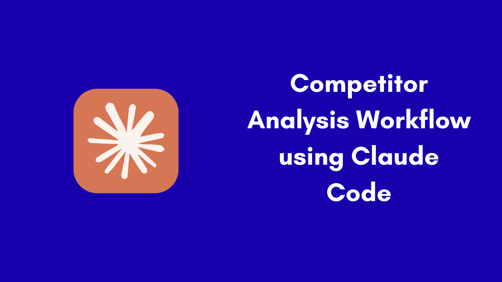

# 🕵️ Competitor Intelligence Agent



> A reasoning agent built on Claude Code that turns competitor pages into product decisions — not a news feed.

---

## 🚫 What this is NOT

Most competitor tools are **news collators** — they scrape headlines, aggregate RSS feeds, and dump a list of links at you. You still have to read everything, form your own opinions, and figure out what it means for your product.

This is different.

| News Collator | This Agent |
|---|---|
| Fetches headlines | Reads + reasons |
| No product context | Knows your features, pricing, roadmap |
| Generic summaries | Gaps, risks, opportunities — relative to *you* |
| You interpret the signal | Signal is pre-interpreted |
| Same output for everyone | Output is unique to your product |

---

## 🧠 What it actually does

This agent is a **reasoning layer on top of your own context**. Every skill loads your `context/` folder before doing anything. That means when it reads a competitor's page, it already knows who you are, what you've built, and what you charge.

The output is never _"here's what OpenAI shipped"_ — it's _"here's what OpenAI shipped, and here's what it means for you specifically."_

---

## 📁 Folder Structure

```
.
├── 📄 competitors.json          # List of competitors to track
├── 📄 watch.sh                  # Automation script — runs weekly report via Claude CLI
│
├── 📂 context/                  # YOUR product knowledge — the agent reads this first, every time
│   ├── product-overview.md      # What your product is, vision, target market, differentiators
│   ├── features.md              # Feature list, architecture, roadmap, known gaps
│   └── pricing.md               # Pricing tiers, model, competitive positioning
│
├── 📂 .claude/                  # Claude Code configuration (auto-loaded)
│   ├── CLAUDE.md                # Project rules and instructions for the agent
│   └── skills/                  # Slash-command skills (invokable inside Claude Code)
│       ├── compare/
│       ├── insights-builder/
│       ├── brainstorm/
│       └── customer-queries/
│
├── 📂 skills/                   # Human-readable copies of skills (reference / copy-paste)
│   ├── compare.md
│   ├── insights-builder.md
│   ├── brainstorm.md
│   └── customer-queries.md
│
└── 📂 reports/                  # Generated reports land here (auto-named by date)
    └── report-YYYY-MM-DD.md
```

---

## 📂 Folder Guide — What to change, what to leave alone

### `competitors.json` — 🔧 Edit freely
The master list of competitors. Each entry has three fields:

```json
{
  "name": "OpenAI",
  "url": "https://openai.com/news",
  "about": "https://openai.com/about"
}
```

- **`url`** — the one page to track (blog, changelog, news page)
- **`about`** — their company/about page for context
- **Add** as many competitors as you want
- **Change** URLs anytime — the next report will use the new ones
- ⚠️ The agent browses **only** these URLs — no open web search

---

### `context/` — 🔧 Edit often, the more honest the better
This is the brain of the agent. Every skill reads these files before generating output. The richer and more accurate these are, the sharper every analysis becomes.

| File | What to put in it |
|---|---|
| `product-overview.md` | Your product's purpose, target market, differentiators, stage |
| `features.md` | Full feature list, architecture notes, roadmap themes, known gaps |
| `pricing.md` | All tiers with prices, billing model, competitive positioning |

**What to update:**
- After a pricing change → update `pricing.md`
- After shipping or killing a feature → update `features.md`
- After a lost deal or new ICP insight → update `product-overview.md`
- After adding a competitor → no changes needed here, just update `competitors.json`

---

### `reports/` — 📖 Read only, never edit manually
All generated reports land here as `report-YYYY-MM-DD.md`. The `/compare` skill diffs the two most recent files in this folder — so the more weeks of reports you accumulate, the richer the comparison history.

**Don't edit these files** — they're the historical record the agent reasons against.

---

### `.claude/skills/` — 🔧 Extend when needed
Each subfolder is a Claude Code slash command. The `skill.md` file contains the prompt and output instructions. You can:
- Edit existing skills to change output format or add new rules
- Add a new folder with a `skill.md` to create a new slash command
- Skills auto-load when you open the project in Claude Code

---

### `skills/` — 📖 Reference copies
Plain markdown versions of each skill — no frontmatter, no Claude-specific syntax. Use these to understand what a skill does, copy the prompt elsewhere, or share with teammates who don't use Claude Code.

---

## ⚡ Skills

Four skills ship out of the box. More can be added by dropping a new folder into `.claude/skills/`.

### `/compare` — Weekly diff report
Reads the two most recent reports in `reports/` and generates a structured diff per competitor. Flags pricing changes, new features, and removed content. Saves result back to `reports/`.

**Use it:** Monday morning standup, weekly competitive review.

---

### `/insights-builder [competitor]` — Deep comparative study
Loads your full `context/` + competitor pages and produces a side-by-side analysis: feature gaps, positioning differences, pricing delta, strategic opportunities, and recommended actions.

**Use it:** Before a sales call, board deck, pricing review, or fundraise.

---

### `/brainstorm <idea>` — Idea validation against the competitive landscape
Takes your idea as input, checks it against your existing features, product vision, pricing model, and what competitors already do. Returns a differentiation score (1–5) and recommended next steps.

**Use it:** Before writing a spec — does this already exist? Does it actually differentiate?

---

### `/customer-queries` — Pain point extractor
Accepts pasted customer feedback, support tickets, or screenshots. Maps pain points to your feature gaps, flags where competitors already solve the problem (churn risk), and outputs prioritized actions.

**Use it:** After support calls, churned accounts, or user interviews.

---

### `/session-summary` — End-of-session recap
Reflects on the current session and produces a structured summary: what was done, decisions made, context files updated, competitors researched, reports generated, and open threads. Saves to `reports/session-YYYY-MM-DD.md`.

**Use it:** End of any working session — creates a handoff note for your next session or your team.

---

### ➕ Adding more skills
Create a new folder under `.claude/skills/<your-skill-name>/` with a `skill.md` file:

```markdown
---
name: your-skill-name
description: >
  One-liner that tells Claude when to trigger this skill.
  Trigger: /your-skill-name, "keyword", "another phrase".
---

# Your skill instructions here
```

Then invoke it in Claude Code with `/your-skill-name`.

---

## 💰 Why token cost stays low

**1. Controlled browsing** — only visits URLs in `competitors.json`. Two pages per competitor per run, nothing more.

**2. Structured output** — every skill fills a defined template. No open-ended generation, no padding.

**3. Context is files** — your product knowledge is flat markdown, read once per invocation. Richer context = better output, not higher cost.

---

## 📈 How it gets smarter over time

The agent reads your `context/` files fresh on every run — no retraining required.

```
Week 1:  context/ = basic overview     →  useful but generic
Week 4:  context/ = detailed + honest  →  sharp, specific recommendations
Week 12: context/ = battle-tested      →  analysis your whole team trusts
```

Every improvement to `context/` immediately improves every skill. Reports accumulate in `reports/` — over time `/compare` isn't just diffing two pages, it's diffing two moments in your competitive landscape.

---

## 🚀 Setup in 3 steps

1. **Edit `competitors.json`** — replace placeholder entries with your real competitors and their key page URLs
2. **Fill `context/`** — add your product overview, feature list, and pricing (be honest about gaps — that's where the value is)
3. **Run `./watch.sh`** — first report lands in `reports/`

```bash
./watch.sh                           # full report, all competitors
./watch.sh --competitor "OpenAI"     # single competitor
```

Everything else improves from there.
